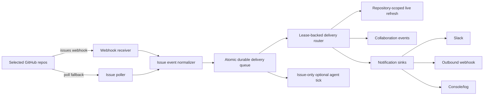

# GitHub Watch Daemon Plan

Status: Phase 1, 2, 3, and 4 implemented.

This document defines the daemon for monitoring selected GitHub
repositories and pushing near-real-time repository-event notifications into OpenSlack
surfaces.

The daemon is not a new source of truth. GitHub, Git, `.openslack`, and
Collaboration events remain the authoritative state. The daemon only observes,
durably queues, records, refreshes, and notifies configured sinks.

## User Value

Teams should not need to manually poll GitHub or run `openslack agent tick`
repeatedly to notice new work. A maintainer should be able to select
repositories, configure notification targets, and receive a push notification
when a matching Issue appears.

Primary user outcomes:

- A new GitHub Issue matching configured filters is detected quickly.
- The detection is recorded as a Collaboration event.
- Slack, webhook, or console sinks receive a compact notification with the
  issue URL and next action.
- Optional auto-claim is available (off by default) and reuses agent identity
  and authorization gates.

## Product Placement

The daemon is a cross-module capability, not a sixth active module.

| Area                         | Responsibility                                                                |
| ---------------------------- | ----------------------------------------------------------------------------- |
| GitHub Issues Task Loop      | Repo allowlist, Issue webhook normalization, polling fallback, task matching. |
| Collaboration Layer          | Event recording, dashboard/room projection, notification audit.               |
| Operator Interface           | User-facing start/status/doctor commands and setup guidance.                  |
| Agent Identity Control Plane | Optional auto-claim authorization.                                            |

Recommended CLI namespace:

```bash
openslack github watch start --config .openslack/monitors/github-watch.yaml
openslack github watch once --config .openslack/monitors/github-watch.yaml
openslack github watch status
```

Do not introduce a generic top-level `openslack daemon` command until the
service monitors more than GitHub Issues/PRs.

## P3 PR And Check Rollout Boundary

P3-PR1 added the strict repository-event contract, normalizers, configuration
allowlist, and hardened webhook ingestion. P3-PR2 now routes every accepted
event through a durable local delivery queue before acknowledgement.

- `pull_request.*` can use the App's existing `pull_request` subscription.
- `pull_request_review.*`, `check_run.completed`, and
  `check_suite.completed` use the manifest's `pull_request_review`,
  `check_run`, and `check_suite` subscriptions plus `checks: read`.
- Existing GitHub App installations must be reauthorized after those manifest
  permissions are deployed. Setup and doctor compare expected and accepted
  permissions/events, verify repository scope with an installation token, and
  print the installation management URL without attempting administrator
  changes.

The P3-PR2 delivery contract is:

- `claimAndEnqueue` performs dedupe and durable enqueue under one exclusive
  local-state lock;
- delivery and route states are `pending`, `processing`, `retryable`,
  `completed`, or `failed`;
- processing leases recover after restart;
- attempts, exponential backoff, retention, state bytes, and record count are
  bounded;
- each route has a stable idempotency key and its own completion ledger;
- the guarantee is at-least-once processing with idempotent effects, not
  crash-proof exactly-once delivery.

PR, review, and check events resolve a live client for the repository named by
the normalized event. The daemon proves that the locked credential context can
access that exact repository before fetching current PR, review, and check
state. A mismatched or out-of-scope repository produces a fixed diagnostic and
no sink dispatch; the daemon never retries against the workspace repository.

Live review observations remain informational. Neither webhook
`review.state=approved` nor the refreshed review summary creates human approval,
merge readiness, or PRMS authority.

## Runtime Architecture



## Configuration

Committed configuration contains only non-secret routing and filters.

```yaml
schema: openslack.github_watch.v1
repositories:
  - owner: Negentropy-Laby
    repo: OpenSlack
    events:
      - issues.opened
      - issues.reopened
      - issues.labeled
    labels:
      include:
        - openslack:task
      exclude:
        - blocked
    routes:
      - sink: slack
        channel: '#openslack-tasks'
      - sink: webhook
        name: local-dev
    auto_claim:
      enabled: false
      agent_ids:
        - openai_developer_ci-bot
```

Secrets stay outside git:

```bash
OPENSLACK_GITHUB_WEBHOOK_SECRET=...
OPENSLACK_SLACK_BOT_TOKEN=...
OPENSLACK_DAEMON_WEBHOOK_URL=...
```

Local daemon runtime state belongs under `.openslack.local/daemon/`.

The delivery ledger is stored in:

```text
.openslack.local/daemon/delivery-state.v1.json
```

The file contains only the whitelist `PersistableRepositoryEvent`, canonical
route identity, attempts, leases, fixed diagnostics, and idempotency keys. It
does not store raw webhook bodies, Issue/review prose, sender handles,
credentials, or outbound webhook URLs. A legacy `dedupe.jsonl` file is imported
as bounded completed tombstones during migration and is no longer written.

### Gated 0.3.0 notification-service boundary

The v1 queue remains the authority for migrated `legacyOwned` routes until its direct drain reaches terminal state.
The explicit `openslack.github_watch.v2` schema now composes separate direct and notification-service workers under
the repository-scoped review policy recorded in
[`notification-delivery-integration.md`](notification-delivery-integration.md). New notification-service admission
remains fail-closed unless `OPENSLACK_NOTIFICATION_SERVICE_NEW_RECORDS=true`; closing that gate does not stop already
durable v2 service records from draining. A valid 202 transfers only that route's authority to the service and never
emits `notification.sent`.

The runtime wiring and read-only reconciliation primitives do not establish G4/G5 or production readiness. Real
two-repository/two-vendor E2E, the 14-day Canary, immutable release evidence and their independent reviews remain
separate gates.

## Event Model

First implementation can map matching task Issues to existing task events:

- `task.created` for an Issue containing a valid `openslack-task` block.
- `task.blocked` when a task Issue is detected but rejected by filters or
  manifest validation.

If more detailed audit is needed, add event types in a later PR:

- `daemon.started`
- `daemon.stopped`
- `daemon.issue.detected`
- `notification.sent`
- `notification.failed`

Every event should include:

- repository full name
- issue number and URL
- GitHub delivery id when available
- dedupe key
- matching labels and capabilities
- notification sink result
- next action command, if known

## Durable Delivery And Cursor Strategy

Webhook and polling may observe the same Issue. The daemon must be idempotent.

Use these keys in order:

1. GitHub webhook delivery id: `X-GitHub-Delivery`.
2. Stable issue action key:
   `github:issues.<action>:<canonical-owner>/<canonical-repo>:issue:<number>:<updated_at>`.
3. Canonical route identity plus the event stable key for each sink effect.
4. Poll cursor per repository: `lastSeenAt`, `lastIssueNumber`, and last
   processed idempotency key.

The v2 queue derives each local `route_record_id` as lowercase hexadecimal SHA-256 over
`openslack.watch.route-record.v2`, the already-lowercase canonical `owner/repo`, and the persisted route idempotency
key, with NUL delimiters. Migrated v1 routes use their copied original key as input; they do not receive a new v2
handoff key. The ID is derived queue identity and is never accepted from watch configuration.

The v2 Blob store, receipt store and `NotificationServiceClient` remain distinct from `NotificationSink`; a service
202 is accepted, not vendor-delivered. The v2 router composes them without adding them to `createSinks`. Queue
operations acquire `queue-v2` before either storage lock; neither storage primitive acquires the queue lock. Receipt
repair from an embedded accepted record never POSTs again.

The queue accepts or rejects duplicates atomically. A successful route is
marked completed immediately and is not resent when another route retries. If
a process exits after a remote sink accepts a message but before the local
completion write, the same idempotency key is reused after lease recovery.

Cursor state is local runtime state and must not be committed. Poll cursors
advance only after observations are durably enqueued or confirmed duplicate.

## Notification Sinks

Initial sinks:

- `console`: prints notifications for local development.
- `slack`: posts to configured Slack channel using the existing Slack bot token
  model.
- `webhook`: posts JSON to an outbound webhook URL.

Every sink receives a stable delivery context:

- Slack receives the route idempotency key as `client_msg_id`.
- Outbound webhooks receive `Idempotency-Key` and
  `X-OpenSlack-Idempotency-Key`.
- Console output includes the same key for replay diagnosis.

Slack and webhook direct delivery share the frozen pure final-body materializers with the future service handoff.
This keeps their outbound bytes identical without connecting the service client or applying the service-only 256 KiB
admission limit to direct delivery.

Sink network errors, timeouts, HTTP 408/429, and 5xx responses are retryable.
Permanent configuration or other 4xx failures terminate only that route.

Notification payload:

```json
{
  "type": "openslack.issue.detected",
  "repo": "Negentropy-Laby/OpenSlack",
  "issueNumber": 123,
  "title": "Fix failing setup",
  "url": "https://github.com/Negentropy-Laby/OpenSlack/issues/123",
  "labels": ["openslack:task", "openslack:ready"],
  "nextAction": "openslack agent tick --agent-id <id> --source github-issues"
}
```

Chat confirmations sent from Slack still do not count as GitHub approval.

## Optional Auto-Claim

Auto-claim is out of scope for the first daemon slice.

When added, it must:

- Default to disabled.
- Require an explicit `agent_id`.
- Resolve a valid agent registry entry and local runtime identity.
- Call `authorizeAgentAction({ action: "task.claim" })`.
- Fail closed if identity, permissions, risk, or path checks fail.
- Record both the detection and claim attempt in Collaboration events.

## Implementation Plan

### Phase 1: Read-Only Watcher

- Add `openslack.github_watch.v1` config parser.
- Add repo allowlist validation.
- Add GitHub webhook signature verification.
- Normalize `issues.opened`, `issues.reopened`, and `issues.labeled`.
- Record detection events.
- Print console notifications.

Acceptance:

- Invalid signatures are rejected.
- Repos outside allowlist are rejected.
- Duplicate GitHub deliveries are ignored.
- A matching Issue produces one event and one console notification.

### Phase 2: Notification Sinks (Implemented)

- Add outbound Slack notification sink (native `fetch()`, no SDK).
- Add outbound webhook notification sink (native `fetch()`, JSON body).
- Route-aware dispatch from `repoConfig.routes`; default to console.
- Record `notification.sent` and `notification.failed` collaboration events.
- Sink failures produce `notification.failed` but do not corrupt cursor state.
- Routes with `sink: 'slack'` require `OPENSLACK_SLACK_BOT_TOKEN`.
- Routes with `sink: 'webhook'` require `OPENSLACK_DAEMON_WEBHOOK_URL`.

Acceptance:

- Slack/webhook failures produce actionable diagnostics.
- Successful notifications include repo, issue, URL, labels, and next action.
- Events are safe after redaction and contain no secrets.

### Phase 3: Polling Fallback (Implemented)

- Polling loop for environments where GitHub webhooks are unavailable.
- Per-repo cursors stored in `.openslack.local/daemon/state.json`.
- Reuses the same dedupe and notification sink pipeline as webhooks.
- `openslack github watch poll --config <path>` for one-shot polling.
- `openslack github watch start --poll --poll-interval <seconds>` for daemon-mode polling.
- `openslack github watch status` shows both dedupe stats and poll cursor state.

Acceptance:

- Polling and webhook paths do not duplicate notifications.
- Restarting the daemon resumes from local cursor state.
- Dry-run/no-credential mode explains what would be watched without mutation.

### Phase 4: Optional Auto-Claim (Implemented)

- `auto_claim.enabled` and `auto_claim.agent_ids` parsed from config.
- `WatchDaemon` accepts an `AutoClaimFn` callback for identity resolution and
  claim execution, avoiding circular dependencies between packages.
- CLI wires the callback using `resolveAgentPrincipal()`, `authorizeAgentAction()`,
  and `claimIssueTask()` — reuses the same 5-step pattern as `agent tick`.
- Claim attempts are recorded as `task.claimed` collaboration events.
- Missing identity, denied permission, or empty `agent_ids` blocks auto-claim
  without crashing the daemon.
- Auto-claim failures do not prevent notification dispatch.
- Auto-claim work is constructed only for the normalized `issue` variant. PR,
  review, check, and push events cannot enter this path.

Acceptance:

- Missing identity blocks auto-claim.
- Denied `task.claim` permission blocks auto-claim.
- Black Zone or critical-risk tasks are not auto-claimed (enforced by
  `authorizeAgentAction`).

### P3-PR2: Durable Repository Event Delivery (Implemented)

- Atomic durable enqueue replaces check-then-record dedupe for Issue, push,
  PR, review, and check observations.
- Route-level leases, completion, retry, failure, and stable idempotency are
  persisted with bounded retention and compaction.
- Webhook acknowledgement waits for the durable write, not the remote sink.
- Expired processing leases are recovered after restart.
- PR/review/check notifications refresh current state through an explicitly
  repository-bound live client.
- Out-of-scope repository access fails closed with a diagnostic.
- Review state remains informational and cannot create approval or merge
  authority.

### P3-PR3: GitHub App Readiness Diagnostics (Implemented)

- The App manifest subscribes to pull-request review, check-run, and
  check-suite events and requests `checks: read`.
- App-JWT inspection reports accepted installation permissions, events,
  repository selection, suspension state, and the GitHub management URL.
- Installation-token inspection is limited to proving target-repository
  accessibility.
- Setup and doctor emit stable ready, reauthorization, event-subscription, and
  repository-scope codes. Administrator changes remain external.

## Test Plan

- Config schema accepts valid repo/sink filters and rejects malformed entries.
- Webhook signature verification accepts valid payloads and rejects invalid
  signatures, old timestamps, and missing delivery ids.
- Normalizer handles Issue opened/reopened/labeled events.
- Dedupe drops duplicate delivery ids and duplicate poll/webhook observations.
- Event recording uses valid Collaboration event schema and redacts secrets.
- Slack/webhook sink tests cover success, non-2xx response, and network error.
- CLI smoke tests cover `watch once`, missing credentials, and invalid config.

## Non-Goals

- Do not make daemon state authoritative.
- Do not store secrets in committed config.
- Do not auto-approve PRs.
- Do not bypass PRMS, CODEOWNERS, branch protection, or agent authorization.
- Do not introduce dashboard-only state.
