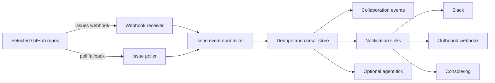

# GitHub Watch Daemon Plan

Status: Phase 1, 2, 3, and 4 implemented.

This document defines the daemon for monitoring selected GitHub
repositories and pushing near-real-time issue notifications into OpenSlack
surfaces.

The daemon is not a new source of truth. GitHub, Git, `.openslack`, and
Collaboration events remain the authoritative state. The daemon only observes,
deduplicates, records events, and notifies configured sinks.

## User Value

Teams should not need to manually poll GitHub or run `openslack agent tick`
repeatedly to notice new work. A maintainer should be able to select
repositories, configure notification targets, and receive a push notification
when a matching Issue appears.

Primary user outcomes:

- A new GitHub Issue matching configured filters is detected quickly.
- The detection is recorded as a Collaboration event.
- Slack, webhook, or console sinks receive a compact notification with the
  issue URL and next action.
- Optional auto-claim is available (off by default) and reuses agent identity
  and authorization gates.

## Product Placement

The daemon is a cross-module capability, not a sixth active module.

| Area | Responsibility |
|------|----------------|
| GitHub Issues Task Loop | Repo allowlist, Issue webhook normalization, polling fallback, task matching. |
| Collaboration Layer | Event recording, dashboard/room projection, notification audit. |
| Operator Interface | User-facing start/status/doctor commands and setup guidance. |
| Agent Identity Control Plane | Optional auto-claim authorization. |

Recommended CLI namespace:

```bash
openslack github watch start --config .openslack/monitors/github-watch.yaml
openslack github watch once --config .openslack/monitors/github-watch.yaml
openslack github watch status
```

Do not introduce a generic top-level `openslack daemon` command until the
service monitors more than GitHub Issues/PRs.

## P3 PR And Check Rollout Boundary

P3-PR1 adds the strict repository-event contract, normalizers, configuration
allowlist, and hardened webhook ingestion. It does not by itself make every
new event available to a deployed GitHub App installation.

- `pull_request.*` can use the App's existing `pull_request` subscription.
- `pull_request_review.*`, `check_run.completed`, and
  `check_suite.completed` require the manifest subscriptions and
  `checks: read` permission scheduled for P3-PR3.
- Existing GitHub App installations must be reauthorized after those manifest
  permissions are deployed. P3-PR3 also owns setup and doctor diagnostics for
  detecting missing subscriptions or stale installation permissions.

P3-PR1 also retains the existing check-then-record `WatchDedupeStore`. Do not
enable high-volume review or check event processing as a production-complete
path until P3-PR2 lands the atomic queue, per-route idempotency, bounded
retention and attempts, backoff, compaction, and restart recovery.

PR, review, and check notifications in P3-PR1 are webhook observations, not
authoritative readiness, approval, or check state. Any workflow that may act
on them must wait for P3-PR2's repository-scoped live-state refresh and must
fail closed when installation scope is missing, mismatched, or unavailable.
This keeps the current PR focused on the event contract and raw webhook trust
boundary without hiding its delivery durability and live-state prerequisites.

## Runtime Architecture



## Configuration

Committed configuration contains only non-secret routing and filters.

```yaml
schema: openslack.github_watch.v1
repositories:
  - owner: Negentropy-Laby
    repo: OpenSlack
    events:
      - issues.opened
      - issues.reopened
      - issues.labeled
    labels:
      include:
        - openslack:task
      exclude:
        - blocked
    routes:
      - sink: slack
        channel: "#openslack-tasks"
      - sink: webhook
        name: local-dev
    auto_claim:
      enabled: false
      agent_ids:
        - openai_developer_ci-bot
```

Secrets stay outside git:

```bash
OPENSLACK_GITHUB_WEBHOOK_SECRET=...
OPENSLACK_SLACK_BOT_TOKEN=...
OPENSLACK_DAEMON_WEBHOOK_URL=...
```

Local daemon runtime state belongs under `.openslack.local/daemon/`.

## Event Model

First implementation can map matching task Issues to existing task events:

- `task.created` for an Issue containing a valid `openslack-task` block.
- `task.blocked` when a task Issue is detected but rejected by filters or
  manifest validation.

If more detailed audit is needed, add event types in a later PR:

- `daemon.started`
- `daemon.stopped`
- `daemon.issue.detected`
- `notification.sent`
- `notification.failed`

Every event should include:

- repository full name
- issue number and URL
- GitHub delivery id when available
- dedupe key
- matching labels and capabilities
- notification sink result
- next action command, if known

## Dedupe And Cursor Strategy

Webhook and polling may observe the same Issue. The daemon must be idempotent.

Use these keys in order:

1. GitHub webhook delivery id: `X-GitHub-Delivery`.
2. Stable issue action key:
   `github:issue:<owner>/<repo>#<number>:<action>:<updated_at>`.
3. Poll cursor per repository: `lastSeenAt`, `lastIssueNumber`, and last
   processed idempotency key.

Cursor state is local runtime state and must not be committed.

## Notification Sinks

Initial sinks:

- `console`: prints notifications for local development.
- `slack`: posts to configured Slack channel using the existing Slack bot token
  model.
- `webhook`: posts JSON to an outbound webhook URL.

Notification payload:

```json
{
  "type": "openslack.issue.detected",
  "repo": "Negentropy-Laby/OpenSlack",
  "issueNumber": 123,
  "title": "Fix failing setup",
  "url": "https://github.com/Negentropy-Laby/OpenSlack/issues/123",
  "labels": ["openslack:task", "openslack:ready"],
  "nextAction": "openslack agent tick --agent-id <id> --source github-issues"
}
```

Chat confirmations sent from Slack still do not count as GitHub approval.

## Optional Auto-Claim

Auto-claim is out of scope for the first daemon slice.

When added, it must:

- Default to disabled.
- Require an explicit `agent_id`.
- Resolve a valid agent registry entry and local runtime identity.
- Call `authorizeAgentAction({ action: "task.claim" })`.
- Fail closed if identity, permissions, risk, or path checks fail.
- Record both the detection and claim attempt in Collaboration events.

## Implementation Plan

### Phase 1: Read-Only Watcher

- Add `openslack.github_watch.v1` config parser.
- Add repo allowlist validation.
- Add GitHub webhook signature verification.
- Normalize `issues.opened`, `issues.reopened`, and `issues.labeled`.
- Record detection events.
- Print console notifications.

Acceptance:

- Invalid signatures are rejected.
- Repos outside allowlist are rejected.
- Duplicate GitHub deliveries are ignored.
- A matching Issue produces one event and one console notification.

### Phase 2: Notification Sinks (Implemented)

- Add outbound Slack notification sink (native `fetch()`, no SDK).
- Add outbound webhook notification sink (native `fetch()`, JSON body).
- Route-aware dispatch from `repoConfig.routes`; default to console.
- Record `notification.sent` and `notification.failed` collaboration events.
- Sink failures produce `notification.failed` but do not corrupt cursor state.
- Routes with `sink: 'slack'` require `OPENSLACK_SLACK_BOT_TOKEN`.
- Routes with `sink: 'webhook'` require `OPENSLACK_DAEMON_WEBHOOK_URL`.

Acceptance:

- Slack/webhook failures produce actionable diagnostics.
- Successful notifications include repo, issue, URL, labels, and next action.
- Events are safe after redaction and contain no secrets.

### Phase 3: Polling Fallback (Implemented)

- Polling loop for environments where GitHub webhooks are unavailable.
- Per-repo cursors stored in `.openslack.local/daemon/state.json`.
- Reuses the same dedupe and notification sink pipeline as webhooks.
- `openslack github watch poll --config <path>` for one-shot polling.
- `openslack github watch start --poll --poll-interval <seconds>` for daemon-mode polling.
- `openslack github watch status` shows both dedupe stats and poll cursor state.

Acceptance:

- Polling and webhook paths do not duplicate notifications.
- Restarting the daemon resumes from local cursor state.
- Dry-run/no-credential mode explains what would be watched without mutation.

### Phase 4: Optional Auto-Claim (Implemented)

- `auto_claim.enabled` and `auto_claim.agent_ids` parsed from config.
- `WatchDaemon` accepts an `AutoClaimFn` callback for identity resolution and
  claim execution, avoiding circular dependencies between packages.
- CLI wires the callback using `resolveAgentPrincipal()`, `authorizeAgentAction()`,
  and `claimIssueTask()` — reuses the same 5-step pattern as `agent tick`.
- Claim attempts are recorded as `task.claimed` collaboration events.
- Missing identity, denied permission, or empty `agent_ids` blocks auto-claim
  without crashing the daemon.
- Auto-claim failures do not prevent notification dispatch.

Acceptance:

- Missing identity blocks auto-claim.
- Denied `task.claim` permission blocks auto-claim.
- Black Zone or critical-risk tasks are not auto-claimed (enforced by
  `authorizeAgentAction`).

## Test Plan

- Config schema accepts valid repo/sink filters and rejects malformed entries.
- Webhook signature verification accepts valid payloads and rejects invalid
  signatures, old timestamps, and missing delivery ids.
- Normalizer handles Issue opened/reopened/labeled events.
- Dedupe drops duplicate delivery ids and duplicate poll/webhook observations.
- Event recording uses valid Collaboration event schema and redacts secrets.
- Slack/webhook sink tests cover success, non-2xx response, and network error.
- CLI smoke tests cover `watch once`, missing credentials, and invalid config.

## Non-Goals

- Do not make daemon state authoritative.
- Do not store secrets in committed config.
- Do not auto-approve PRs.
- Do not bypass PRMS, CODEOWNERS, branch protection, or agent authorization.
- Do not introduce dashboard-only state.
